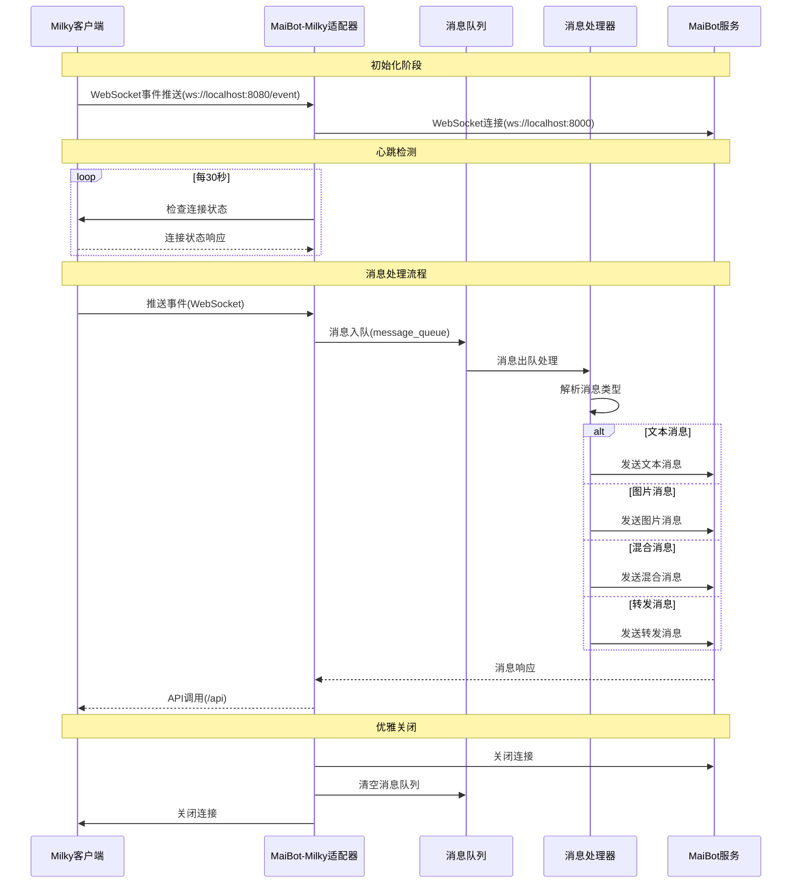

# MaiBot 与 Milky 的 Adapter
运行方式：独立/放在MaiBot本体作为插件

# 使用说明
这是一个连接 MaiBot 和 Milky 框架的适配器。Milky 是一个基于 Lagrange 的 QQ 机器人框架。

# 消息流转过程



# 配置说明

## Milky 配置
```toml
[milky_server]
host = "localhost"      # Milky 服务端主机地址
port = 8080             # Milky 服务端端口
event_endpoint = "/event" # Milky 事件推送端点
api_endpoint = "/api"     # Milky API调用端点
access_token = ""         # Milky API访问令牌，用于鉴权
```

## API 调用方式

适配器使用 HTTP POST 请求调用 Milky API，支持以下格式：

### 请求格式
```
POST /api/{action}
Content-Type: application/json
Authorization: Bearer {access_token}

{
  "param1": "value1",
  "param2": "value2"
}
```

### 响应格式
```json
// 成功响应
{
  "status": "ok",
  "retcode": 0,
  "data": {
    // 具体数据
  }
}

// 失败响应
{
  "status": "failed",
  "retcode": -400,
  "message": "错误信息"
}
```

### HTTP 状态码
- `200`: 请求成功（无论操作是否成功）
- `401`: 鉴权凭据未提供或不匹配
- `404`: 请求的 API 不存在
- `415`: POST 请求的 Content-Type 不支持

## WebSocket 事件推送

适配器通过 WebSocket 连接接收 Milky 的事件推送：

### 连接格式
```
ws://{IP}:{端口}/event?access_token={access_token}
```

### 事件数据格式
```json
{
  "time": 1234567890,
  "self_id": 123456789,
  "event_type": "message_receive",
  "data": {
    "message_scene": "friend",
    "peer_id": 123456789,
    "message_seq": 23333,
    "sender_id": 123456789,
    "time": 1234567890,
    "message": [
      {
        "type": "text",
        "data": {
          "text": "Hello, world!"
        }
      }
    ]
  }
}
```

# 测试

项目包含完整的测试套件，用于验证 Milky 适配器的功能：

## 运行所有测试
```bash
python run_tests.py
```

## 运行单个测试
```bash
# 测试 API 调用
python tests/test_api.py

# 测试 Milky 通信层
python tests/test_milky.py

# 测试 API 合规性
python tests/test_milky_api_compliance.py

# 测试 WebSocket 合规性
python tests/test_websocket_compliance.py
```

## 测试内容

- **test_api.py**: 测试工具函数中的 API 调用
- **test_milky.py**: 测试 Milky 通信层的基本功能
- **test_milky_api_compliance.py**: 验证 API 调用是否符合 Milky 规范
- **test_websocket_compliance.py**: 验证 WebSocket 事件推送是否符合 Milky 规范

## 测试要求

运行测试前请确保：
1. Milky 服务正在运行
2. 配置文件 `config.toml` 已正确设置
3. 所有依赖包已安装：`pip install -r requirements.txt`

## 支持的事件类型
- `message_receive`: 消息接收事件
- `message_recall`: 消息撤回事件
- `friend_request`: 好友请求事件
- `group_join_request`: 入群请求事件
- `group_invited_join_request`: 群成员邀请他人入群请求事件
- `group_invitation`: 他人邀请自身入群事件
- `friend_nudge`: 好友戳一戳事件
- `group_nudge`: 群戳一戳事件
- `group_member_increase`: 群成员增加事件
- `group_member_decrease`: 群成员减少事件
- `group_admin_change`: 群管理员变更事件
- `group_mute`: 群禁言事件
- `group_whole_mute`: 群全体禁言事件
- `bot_offline`: 机器人离线事件

## 支持的 API 调用
- `send_private_message`: 发送私聊消息
- `send_group_message`: 发送群聊消息
- `set_group_member_mute`: 设置群成员禁言
- `set_group_whole_mute`: 设置群全体禁言
- `kick_group_member`: 踢出群成员
- `send_group_nudge`: 发送群戳一戳
- `recall_group_message`: 撤回群消息

# TO DO List
- [x] 读取自动心跳测试连接
- [x] 接受消息解析
  - [x] 文本解析
  - [x] 图片解析
  - [x] 文本与消息混合解析
  - [x] 转发解析（含图片动态解析）
  - [ ] 群公告解析
  - [x] 回复解析
  - [ ] 群临时消息（可能不做）
  - [ ] 链接解析
  - [x] 戳一戳解析
    - [x] 读取戳一戳的自定义内容
  - [ ] 语音解析（？）
  - [ ] 所有的notice类
    - [x] 撤回（已添加相关指令）
- [x] 发送消息
  - [x] 发送文本
  - [x] 发送图片
  - [x] 发送表情包
  - [x] 引用回复（完成但是没测试）
  - [ ] 戳回去（？）
  - [x] 发送语音
- [x] 使用echo与uuid保证消息顺序
- [x] 执行部分管理员功能
  - [x] 禁言别人
  - [x] 全体禁言
  - [x] 群踢人功能

# 特别鸣谢
特别感谢[@Maple127667](https://github.com/Maple127667)对本项目代码思路的支持

以及[@墨梓柒](https://github.com/DrSmoothl)对部分代码想法的支持